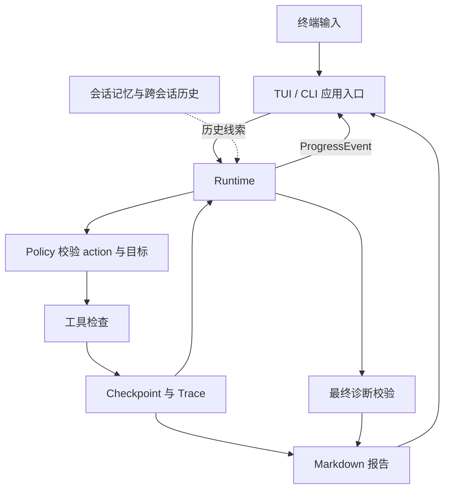

# go-sre-agent

**在终端里排障，让每个结论都能回到检查记录。**

`go-sre-agent` 是用 Go 实现的 SRE 诊断 Agent。默认入口是单列 TUI：输入问题，观察真实工具检查的进度，得到简短结论，再按需打开证据或完整报告。它也保留逐行交互和适合脚本调用的子命令。

Agent 可以检查 HTTP、日志、PostgreSQL、Redis、Kafka、WebSocket 和 Docker。模型负责选择检查与组织诊断，Runtime 负责执行、保存和约束；最终证据必须指向**本次 Run 的真实 Trace**。项目没有依赖 LangChain、AutoGen 等 Agent 框架。

## 从一次 500 开始

登录接口返回 500 时，“数据库问题”只是一个待验证的假设。能复核的诊断需要交代：接口是否真的返回 500、日志里看到了什么、数据库检查是否成功，以及哪些事情仍未确认。

仓库提供固定的离线场景来演示这条路径。它会模拟三项检查，TUI 最终给出的信息类似：

```text
Backend health: Unhealthy - 登录接口返回 500
Observed issue: PostgreSQL 连接检查失败
Cause: Not confirmed
Assessment: 数据库连接异常，根因仍需进一步确认。

/report Full report    /evidence Check evidence
```

这里的健康状态来自本次 HTTP 检查；PostgreSQL 检查指出了异常位置。`connection refused` 可以作为线索，却不足以单独证明数据库服务本身就是根因，因此结论仍标记为未确认。需要逐项核对时，打开 `/evidence`；需要完整过程时，打开 `/report`。

## 先跑一遍：完全离线的 TUI

需要 **Go 1.22 或更新版本**。在仓库根目录构建：

```bash
go build -o ./sre ./cmd/sre-agent
./sre --config configs/tui-demo.yaml --mock-scenario tui-demo
```

输入 `登录接口返回 500` 并按 Enter。这个场景只调用进程内的模拟工具，不连接模型、数据库、Docker 或业务服务。演示产生的 Run、会话和报告分别放在 `.demo-runs/`、`.demo-sessions/`、`.demo-reports/`；这些目录以及根目录的 `sre` 可执行文件已被 Git 忽略。

| 想做什么 | 在 TUI 中输入或按键 |
| --- | --- |
| 开始诊断 | 输入普通文本，按 Enter |
| 查找命令 | `/help`；用 ↑/↓ 选择，列表会跟随滚动 |
| 查看详细结果 | `/report` 或 `/evidence`；只读详情按 Esc 或 `q` 返回 |
| 查看会话和 Run | `/sessions`、`/runs`；可用 `/use` 或 `/resume` |
| 查看工具与历史来源 | Ctrl-O |
| 滚动历史 | PgUp / PgDn；离开底部后暂停自动跟随 |
| 取消或退出 | 运行中按 Ctrl-C 等待保存；空闲且输入为空时按 Ctrl-D，或输入 `/exit` |

运行中可以编辑下一条草稿，但不会自动排队。TUI 的固定提示使用英文；模型结论和工具证据保留原文。模型请求期间用 `Thinking.`、`Thinking..`、`Thinking...` 循环提示，工具执行期间用三点方形轮转标记 `Calling <tool>...`；当前阶段也会留在底部状态栏，向上查看历史时仍然可见。这些状态来自已保存的模型调用和真实工具事件，动画与耗时定时刷新。结构化模型结论会在完成后一次显示，不展示内部推理。完整按键与命令列表见 [交互式 CLI](docs/interactive-cli.md)。

## 一条诊断如何成为报告



**检查与结论分开。** 每条工具记录都保留执行状态、目标健康状态、目标身份、时间和脱敏后的结构化事实。模型可以提出诊断，但引用的证据必须能在本次 Trace 中找到。根因通过 `identified`、`suspected`、`undetermined` 表示结论强度；证据不足时不会把猜测写成已确认事实。TUI 的简短健康判断也只使用本次检查，无法判断时显示 `Unverified`。

**历史与当前证据分开。** 诊断会自动加载当前会话上下文，并按服务、环境和目标检索跨会话记忆，最多取 3 条、总计 12 KiB。TUI 显示的命中数量来自实际注入模型的同一批结果。历史可帮助决定下一步检查，不能代替本次证据；新建会话后仍可检索同范围的历史。符合条件的 Run 会自动收录，无需先执行 `/memory`，主回复也不会显示收录流程。

**执行过程可以恢复。** 每次模型和工具调用都有持久化状态；独立的只读工具可有限并行，并用 `call_id` 关联结果。Ctrl-C 会请求取消并等待保存。恢复时，已中断调用不会被当作成功；若存在结果未知的有副作用调用，自动恢复会受限。大工具输出可以在模型上下文中按预算裁剪，完整脱敏证据仍保留在 Run/Trace 中。详见 [运行恢复](docs/run-recovery.md)、[上下文与进度](docs/runtime-context-progress.md) 和 [证据约束](docs/evidence-constraints.md)。

## 接入真实环境

先创建本地配置，再检查目标与白名单：

```bash
cp configs/config.example.yaml configs/config.yaml
cp .env.example .env
```

- 在 `configs/config.yaml` 设置服务与环境标签、目标地址、允许访问的主机、日志目录、容器和工具。`targets.service` 与 `targets.environment` 也是跨会话记忆的隔离范围。
- 在 `.env` 设置 `SRE_AGENT_LLM_PROVIDER` 及对应模型的地址、名称和凭据。支持 OpenAI-compatible、Ollama 和 Anthropic；变量示例见 [.env.example](.env.example)。
- 如需不同配置路径，启动时传 `--config`。完整配置字段见 [通用示例](configs/config.example.yaml)；本机 Go Chat Compose 可参考 [专用示例](configs/go-chat-compose.example.yaml)。

```bash
./sre llm ping
./sre
```

stdin 和 stdout 都是可用终端时，`./sre` 默认进入 TUI。终端不支持全屏界面时使用 `./sre --plain`；没有子命令且输入被重定向时，程序会显示用法并退出。指定 `--session-id <id>` 可重建该会话已保存的视图，但不会自动恢复尚未完成的 Run。

诊断规则位于 [skills/sre-diagnosis/SKILL.md](skills/sre-diagnosis/SKILL.md)。真实模型诊断启动时会读取它作为 system message；mock 场景不调用模型。配置中的白名单和目标注入由程序执行，历史资料与外部文本不能修改这些边界。

### 需要脚本接口时

```bash
./sre diagnose --goal "检查登录接口返回 500 的原因"
./sre status --run-id <run_id>
./sre report --run-id <run_id>
./sre resume --run-id <run_id>
```

`diagnose` 的报告会写到终端；配置 `paths.report_dir` 后也会保存为 Markdown。运行状态默认保存在 `.runs/`，会话状态默认保存在 `.sessions/`。非交互子命令继续使用原有输出格式和退出码；`--plain` 保留逐行交互。常用的其他入口包括 `llm ping|chat`、`memory search|collect|rebuild|invalidate|correct|delete` 和 `eval mock|model`。完整参数见 `./sre --help`、[交互式 CLI](docs/interactive-cli.md)、[跨会话记忆](docs/cross-session-memory.md) 与 [评测说明](docs/evaluations.md)。

> **Mock 场景的区别：** `tui-demo` 使用本地模拟工具，适合完全离线体验。`login-500`、`dependency-check` 和 `websocket` 使用预设动作，但仍会调用配置中的真实诊断目标；不要把它们当作离线演示。

## 工具与执行边界

| 范围 | 工具 | 能看到什么 |
| --- | --- | --- |
| 入口与日志 | `http_check`、`websocket_check`、`log_read` | HTTP 状态与延迟、WebSocket 握手、允许目录内的日志 |
| 数据依赖 | `postgres_ping`、`postgres_check`、`redis_ping`、`redis_check`、`redis_scan` | 协议可达性、认证与 SQL 检查、Redis 状态和白名单前缀内的键 |
| 消息链路 | `kafka_check`、`kafka_compose_check` | Broker、Topic、消费组与活跃 lag |
| 容器 | `docker_ps`、`docker_inspect`、`docker_logs`、`docker_stats`、`docker_probe` | 允许容器的状态、日志、资源指标和固定探测结果 |
| 合成事务 | `smoke_run` | 配置的端到端脚本结果；**可能产生真实写入** |

工具和参数需通过 schema 与策略校验，HTTP/WebSocket 主机、日志路径、Docker 容器等受配置白名单限制；响应头仅保存显式允许的字段，常见凭据会脱敏。`smoke_run` 默认不注册，只有显式配置 `targets.smoke_command` 才可使用；应仅指向可丢弃的本地或测试环境。`postgres_ping` 只证明协议层可达，`websocket_check` 的 ping 只验证协议层消息通路，不能替代业务层检查。

## 继续阅读与开发

- [架构](docs/architecture.md)：Runtime、工具、Policy、Trace 的职责。
- [会话记忆](docs/session-memory.md) 与 [跨会话记忆](docs/cross-session-memory.md)：保存、隔离和人工维护规则。
- [故障注入](docs/fault-injection.md) 与 [评测](docs/evaluations.md)：回归场景和真实模型评测边界。
- [更多命令示例](docs/examples.md)：常见目标与脚本调用。

```bash
go test ./...
go vet ./...
```

当前跨会话检索使用服务、环境和固定关键词，还没有向量检索；动态检查建议主要由模型生成。Run 历史增长后的存储迁移和更多故障注入样本仍是后续工作。
